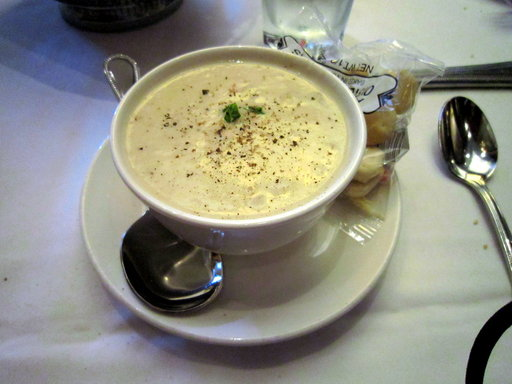

# MLOps Project 1

#### Latest changes available in [dev](https://github.com/CodeProcessor/MLOps-Project-1/tree/dev) branch.

## Problem Statement

This project is aims to build a model to predict an image consists of a pizza or not.

| Image | Prediction |
| ------ | ---------- |
|  | Pizza |
|  | Not Pizza |

This project aims to give an endpoint which can be used to predict an image.

The output is a JSON object with the following fields:

```json
{
  "class": "Pizza",
  "confidence": "0.6911602020263672"
}
```

## Data

Data is downloaded from Kaggle.
Link - [dataset](https://www.kaggle.com/datasets/carlosrunner/pizza-not-pizza)

## Model

Primary model is resnet 50 with transfer learning.

